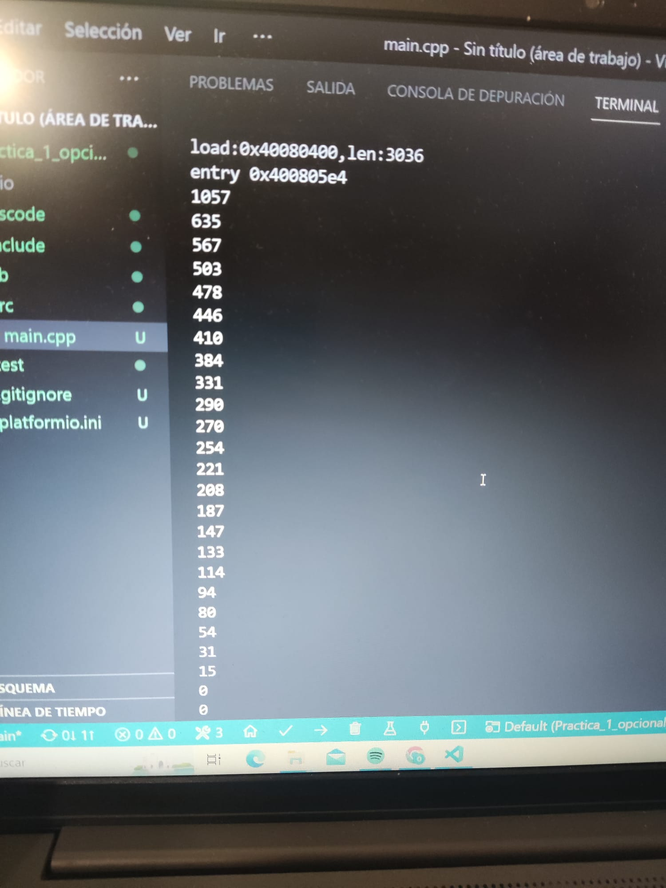

# Ejercicios voluntarios de mejora de nota
### Codi exercici voluntari

```c
#include <Arduino.h>

const int potPin = 34;
int potValue = 0;

void setup() {
    Serial.begin(115200);
    delay(1000);
}

void loop() {
    potValue = analogRead(potPin);
    Serial.println(potValue);
    delay(500);
}
```

### Imatge Terminal



### Exercici voluntari:
Llegir el valor de un convertidor A/D de entrada; treurel per el port serie i treure el mateix valor per un altre pin
