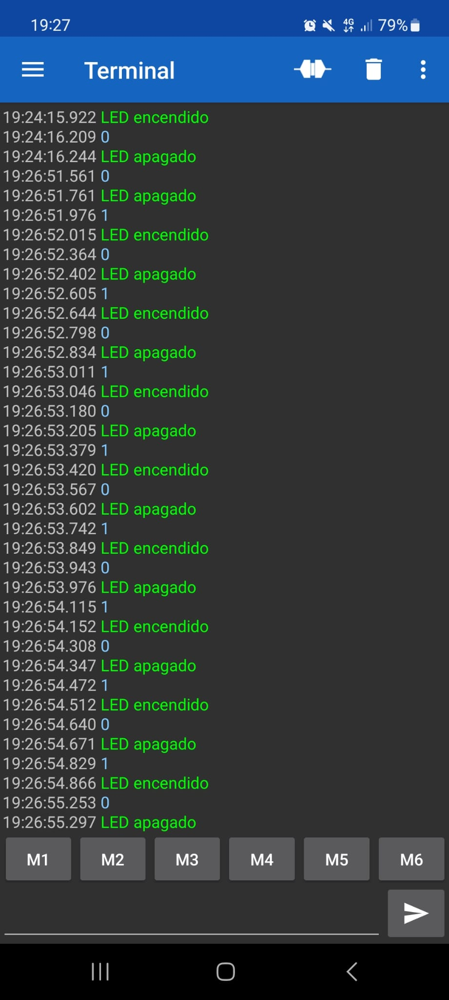

# Exercici Opcional P3

### Codi

```c
#include "BluetoothSerial.h"
#if !defined(CONFIG_BT_ENABLED) || !defined(CONFIG_BLUEDROID_ENABLED)
#error Bluetooth is not enabled! Please run `make menuconfig` to and enable it
#endif
#define LED 23

BluetoothSerial BT; // Objeto Bluetooth
void setup() {
  Serial.begin(115200); // Inicialización de la conexión en serie para la depuración
  BT.begin("ESP32_LED_Control"); // Nombre de su dispositivo Bluetooth y en modo esclavo
  Serial.println("El dispositivo Bluetooth está listo para emparejarse");
  pinMode (LED, OUTPUT); // Cambie el pin LED a OUTPUT
}
void loop() {
  if (BT.available()) // Compruebe si recibimos algo de Bluetooth
  {
    int incoming = BT.read(); // Lee lo que recibimos
    Serial.print("Recibido: ");
    Serial.println(incoming);
    if (incoming == 49){ // 1 en ASCII
      digitalWrite(LED, HIGH); // LED Encendido
      BT.println("LED encendido"); // Envía el mensaje de texto a través de BT Serial
    }
    if (incoming == 48){ // 0 en ASCII
      digitalWrite(LED, LOW); // LED Apagado
      BT.println("LED apagado"); // Envía el mensaje de texto a través de BT Serial
    }
  }
  delay(20);
}
```

**Imatge de encendre i apagar LED**




### Video del Funcionament


### Informe
En aquest cas, enllacem la ESP32 amb el mòvil també per bluetooth i amb el mòvil aconseguim apagar i encendre un led conectat a la placa. D'aquesta manera, cada vegada
que el led s'encén s'imprimeix el missatge "LED encendido" i  quan s'apaga surt el missatge "LED apagado"
