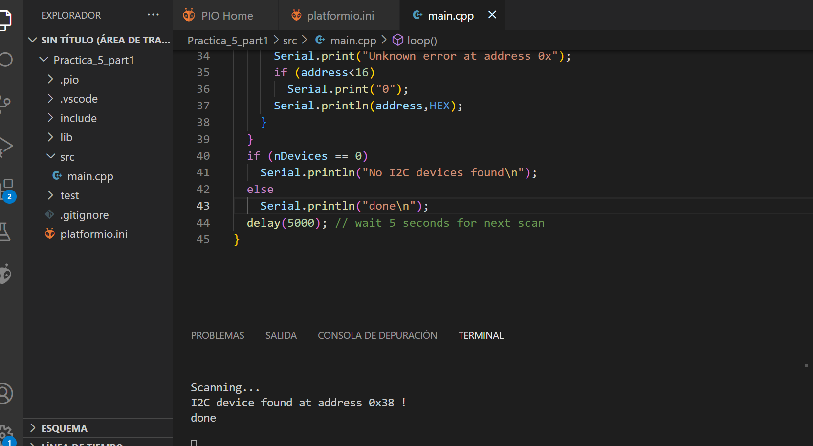

# Pràctica 5 part 1

## Codi

```c
#include <Arduino.h>
#include <Wire.h>
void setup()
{
  Wire.begin();
  Serial.begin(115200);
  while (!Serial); // Leonardo: wait for serial monitor
    Serial.println("\nI2C Scanner");
}
void loop()
{
  byte error, address;
  int nDevices;
  Serial.println("Scanning...");
  nDevices = 0;
  for(address = 1; address < 127; address++ )
  {
  // The i2c_scanner uses the return value of
  // the Write.endTransmisstion to see if
  // a device did acknowledge to the address.
    Wire.beginTransmission(address);
    error = Wire.endTransmission();
    if (error == 0)
    {
      Serial.print("I2C device found at address 0x");
      if (address<16)
        Serial.print("0");
      Serial.print(address,HEX);
      Serial.println(" !");
      nDevices++;
    }
    else if (error==4)
    {
      Serial.print("Unknown error at address 0x");
      if (address<16)
        Serial.print("0");
      Serial.println(address,HEX);
    }
  }
  if (nDevices == 0)
    Serial.println("No I2C devices found\n");
  else
    Serial.println("done\n");
  delay(5000); // wait 5 seconds for next scan
}

```

### Imatge



### Informe
El codi consisteix en enllaçar l'escàner amb la esp32 per entendre el funcionament de les trames I2C. Al executar el codi ens aniran sortint diferents missatges per 
pantalla indicant com es va realitzant la conexió. D'aquesta manera, quan ens trobi un dispositiu I2C ens dirà en quina adressa es troba. Per altre banda, si no en 
troba cap ens dira "No I2C devices found". En el nostre cas hi vam conectar l'escàner i ens el va trobar.
