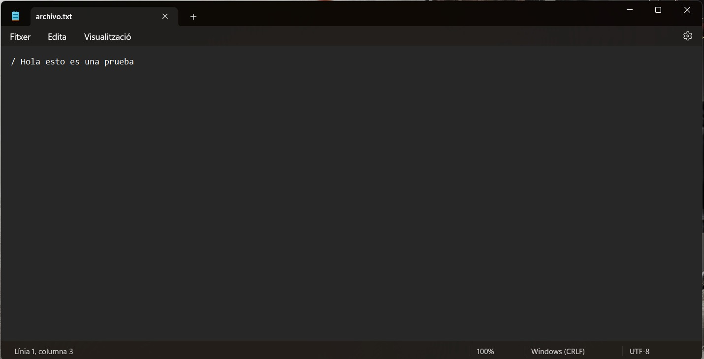

# Pràctica 6 part 1

### Codi

```c

#include <SPI.h>
#include <SD.h>

File myFile;

void setup()
{
  Serial.begin(115200);
  Serial.print("Iniciando SD ...");
  if (!SD.begin(5)) {
    Serial.println("No se pudo inicializar");
    return;
  }
  Serial.println("inicializacion exitosa");
 
  myFile = SD.open("/archivo.txt");//abrimos  el archivo 
  if (myFile) {
    Serial.println("/archivo.txt:");
    while (myFile.available()) {
    	Serial.write(myFile.read());
    }
    myFile.close(); //cerramos el archivo
  } else {
    Serial.println("Error al abrir el archivo");
  }
}

void loop()
{
  
}

```

### Describir la salida por el puerto série (Foto)



### Explciar el funcionamiento
A partir del siguiente código accedemos a la microSD y podemos leer un fichero de un nombre determinado. Al declarar la ruta y el nombre del archivo, el programa
muestra por el puerto série el contenido de este, ya que se trata de un fichero de texto simple.
